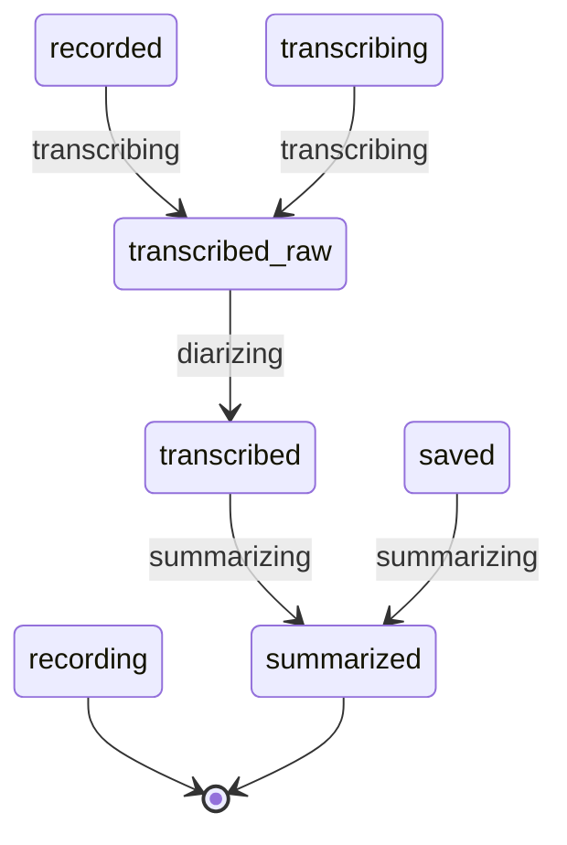

# Рефакторинг состояния пайплайна

_Составлено 2026-07-27 по коду на `7d7472e`. Рабочий документ: чертёж перед правкой, не описание существующего._

**Цель:** свести состояние обработки встречи к одной модели, чтобы «статус завис», «спиннер на чужой записи» и «теги пропали» стали **невыразимыми состояниями**, а не багами, которые ловят тестами.

**Не цель:** новая функциональность, редизайн UI, разбор `RecordingDetailView` (1984 строки) — отдельная работа.

---

## 1. Что имеем: четыре источника правды

Состояние одной встречи сегодня хранится в четырёх независимых местах.

| # | Источник | Природа | Значения | Кто пишет |
|---|---|---|---|---|
| 1 | `RecordingEntry.status: String` | персистентный, на запись | `recording · recorded · transcribing · transcribed_raw · transcribed · saved` | `RecordingStore.update` |
| 2 | `transcribeStep` / `saveStep` / `recapStep` | эфемерный, **один комплект на всё приложение** | `pending · running · done · failed` | `AppState` |
| 3 | Файлы на диске (`*-recap.md`) | внешний | есть / нет | `MarkdownWriter`, `RecapService` |
| 4 | `entry.topics == nil` | персистентный, косвенный | «метаданные не прогонялись» | `generateMeetingMetadata` |

Ни один не назначен главным, поэтому UI читает то один, то другой, а местами склеивает:

```swift
// RecordingDetailView.swift:629
} else if state.saveStep == .done || entry.status == "saved" {
```

Это не небрежность, а неизбежность: при двух источниках без приоритета единственный безопасный оператор — ИЛИ.

**Верхняя граница пространства состояний** (декартово произведение 10 полей, включая `busyRecordingID` и `statusIsTransient`) — около **37 000** комбинаций. Достижимых меньше, но сколько именно — не знает никто, и это и есть проблема: легальных из них одиннадцать (§5).

---

## 2. Дефекты, подтверждённые по коду

### D1. Пайплайн параллелен, хотя весь код борется за то, чтобы он был последовательным

`runTranscribe` освобождает лок ASR **до** вызова save/recap:

```swift
// AppState.swift:1118-1127
isTranscribing = false          // ← лок снят
endPipelineWork(recordingID)
...
await runSave(...)              // ← а работа продолжается: save → recap
```

`await runSave` — точка приостановки. Пока идёт recap встречи A (десятки секунд на Ollama), `MainActor` свободен, и второй `Stop` запускает ASR встречи B. **Recap A и ASR B выполняются одновременно.**

При этом почти вся остальная логика написана, чтобы этого избежать: backfill проверяет `!isTranscribing` (`:795`, `:836`), проверяет `thermalState` (`:799`, `:837`), проверяет `!zoomMeetingDetected` — «не грузить 4 ГБ модель во время звонка». То есть параллельность — не решение, а недосмотр, вокруг которого выстроены заплатки.

Прямое следствие — `pipelineWorkDepth`: счётчик вложенности begin/end, нужный только потому, что работ может быть несколько. И `busyRecordingID`, который хранит **одну** запись: при параллельной работе вторая теряет спиннер.

### D2. Глобальные шаги обслуживают несколько записей вручную

`transcribeStep` один на приложение, встреч в обработке может быть больше. Компенсация — 23 ручные проверки вида `selectedRecordingID == recordingID`, `busyRecordingID != nil && busyRecordingID != entry.id`, `if busyRecordingID == nil { не трогаем шаги }`.

Каждая написана руками, каждая забытая — новый баг. Компилятор не помогает: он не знает, что эти поля связаны. Пять пронумерованных дефектов `BUG-PIPE-01…05` — один и тот же класс.

### D3. `status` — строка, а не тип

41 строковый литерал в шести файлах. Опечатка компилируется. Добавление стадии не заставляет компилятор показать места, где её надо обработать.

### D4. «Есть ли саммари» вычисляется сканированием директории — четырьмя разными реализациями

`AppState.resolvedRecapURL` (`:601`), `AppState.findRecapURL` (`:1453`), `RecordingDetailView.resolvedRecapURL` (`:991`), плюс поиск в `RecapService:381`. Все ищут `<id>-*-recap.md`, все чуть по-разному. `backfillMissingSummaries` вызывает `hasRecap` в фильтре по всем записям — обход директории на каждую встречу, на каждом цикле планировщика (раз в 180 с).

### D5. Два независимых пути генерации саммари

Основной: `runSave → runRecap → RecapService.generateRecap` (`:1296`).
Фоновый: `backfillOne → RecapService.generateRecap` (`:911`) напрямую, со своей обработкой результата, своим `generateMeetingMetadata`, своей записью markdown.

Правило, изменённое в одном пути, молча расходится с другим.

### D6. `runTranscribe` и `completeDiarization` — ~90 строк почти идентичного кода

Отличие только в том, что вторая пропускает фазу ASR и берёт сегменты из `rawSegmentsJSON`. Оркестрация, обработка ошибок, переходы статусов и хвост «save или reconcile» продублированы целиком.

### D7. Три независимых механизма планирования

`enqueueOrRunTranscribe` (очередь на одну позицию — фактически «показать статус и забыть»), `reconcilePendingPipeline` (рекурсивный добор после каждого завершения), `NSBackgroundActivityScheduler` для backfill (`:881`) со своим набором guard-ов. Три ответа на один вопрос «что делать дальше».

### D8. Ошибка пайплайна — глобальная, хотя относится к записи

`pipelineError` — одно поле на приложение. Ошибка встречи A стирается началом работы над B (`pipelineError = nil` на `:1026`). Отсюда ветвление `if selectedRecordingID == recordingID { surfacePipelineError } else { pipelineError = msg }` (`:1102-1108`) — попытка «сохранить ошибку на потом», которая не работает, если между делом стартовала другая работа.

Та же путаница в `recapSkipHint`: 10 присваиваний, смешивающих две разные природы — состояние **конфигурации** («нет провайдера — поставьте Ollama») и **ошибку выполнения** («не удалось прочитать транскрипт»). Первое выводится из настроек и вообще не должно храниться.

### D9. Мёртвое дублирующее поле

`AppState.micOnlyRecording` не читается ни одной вьюхой — UI берёт `entry.micOnlyCaptured` (`RecordingDetailView:390`). Поле поддерживается в четырёх местах впустую.

---

## 3. Целевая модель

Два измерения, которые сегодня перемешаны, разделяются. Одно персистентно и отвечает «докуда эта запись дошла». Другое эфемерно и отвечает «что делается прямо сейчас» — и при старте выводится из первого.

### 3.1. Стадия — персистентно, в `RecordingEntry`

Реализовано в [`PropellerPure/RecordingStage.swift`](../swift/PropellerPure/RecordingStage.swift).

**`rawValue` намеренно совпадает с сегодняшними строками.** Формат `recordings.json` не меняется: старое приложение прочитает новый файл, новое — старый. Главный риск проекта (потеря пользовательского архива при миграции) сводится к одному новому значению вместо переписывания формата.

Стадия заменяет источники **1**, **3** и **4** из §1: «нужен ли саммари» становится сравнением стадий, а не сканированием директории.

`transcribing` **остаётся** в перечислении, хотя по смыслу это активность, а не достигнутое состояние. Причина в данных: у всех, кто крашнулся посреди ASR, эта строка лежит на диске, и `RecordingRecovery` разбирает именно её. Убрать кейс — значит потерять различие «крашнулись с транскриптом» / «без», то есть терять час работы GPU. Единственное состояние, где стадия временно врёт про активность; после `load()` оно недостижимо.

### 3.2. Активность — эфемерно, одно поле на приложение

```swift
enum PipelineActivity {
    case idle
    case working(recordingID: String, phase: Phase, detail: String?)

    enum Phase { case transcribing, diarizing, saving, summarizing }
}
```

**Только две ветки.** Ошибки здесь нет намеренно — см. §3.3.

Базовый текст («Определяем спикеров…») выводится из `phase` функцией, а не хранится строкой. `detail` — необязательное уточнение от сайдкара («чанк 2 из 5»). Пустой `detail` всегда даёт корректный UI, поэтому «строка прогресса соврала» становится непредставимым.

Заменяет источник **2** и семь полей: `transcribeStep`, `saveStep`, `recapStep`, `busyRecordingID`, `statusMessage`, `statusIsTransient`, `pipelineWorkDepth`.

### 3.3. Ошибка — свойство записи, а не приложения

```swift
// в RecordingEntry, персистентно
struct PipelineFailure: Codable {
    let phase: String
    let message: String
    let at: Date
}
var lastFailure: PipelineFailure?
```

Это исправление D8 и одновременно защита от бесконечного цикла: очередь (§3.4) пропускает записи с непустым `lastFailure`, пока пользователь не нажмёт «Повторить» — что поле очищает. Без этого запись с удалённым аудиофайлом (`AppState:1015`) возвращалась бы воркеру вечно.

Персистентность даёт то, чего сегодня нет: ошибка переживает перезапуск и видна на карточке встречи, когда её откроют через час.

`recapSkipHint` удаляется целиком. Конфигурационная его половина («нет провайдера») выводится из настроек — `needsLocalRecapModel` уже это делает; половина «ошибка выполнения» уходит в `lastFailure`.

### 3.4. Один воркер, очередь — производная от стадий

Пайплайн становится тем, чем код и так пытается быть: одна последовательная очередь.

```swift
// Чистая функция, PropellerPure. Очередь нигде не хранится — она вычисляется.
func nextJob(from recordings: [RecordingEntry], policy: WorkerPolicy) -> Job? {
    guard policy.mayWork else { return nil }     // не во время записи / звонка / перегрева
    return recordings
        .filter { $0.stage > .recording && $0.stage < .summarized && $0.lastFailure == nil }
        .min(by: { $0.date < $1.date })
        .map { Job(id: $0.id, phase: $0.stage.nextPhase) }
}
```

Три следствия, каждое — удаление кода:

**Очередь не хранится.** Она выводится из персистентных стадий, поэтому переживает краш без отдельного механизма восстановления. `reconcilePendingPipeline` перестаёт быть процедурой и становится вызовом `nextJob`.

**Backfill исчезает как подсистема.** Встреча со стадией `saved` — просто встреча, которой нужна работа; ей займётся тот же воркер. `isBackfilling`, `backfillOne`, `backfillMissingMetadata`, `NSBackgroundActivityScheduler` и дублирующий путь D5 удаляются. Их guard-ы («не во время звонка, не на горячей машине») переезжают в `WorkerPolicy` — одно место вместо четырёх, и теперь они действуют на **весь** пайплайн, а не только на фоновую его половину.

**Локи схлопываются.** `isTranscribing`, `isReconcilingPipeline`, `isBackfilling`, `pipelineWorkDepth` → одно «воркер занят», выраженное самим `activity != .idle`.

Возражение «параллельность быстрее» проверено и отвергается: ASR и Ollama конкурируют за ANE/GPU, и код уже платит guard-ами, чтобы их развести. Последовательность не замедляет — она делает честным то, что и так происходит.

`WorkerPolicy` фиксирует явно то, что сегодня подразумевается: воркер не работает во время активной записи, во время обнаруженного звонка и при `thermalState ≥ .serious`.

---

## 4. Схема стадий

**Эта диаграмма проверяется тестом** (`PipelineDiagramTests`): она рендерится из `RecordingStage` и сверяется с копией ниже. Разойтись с кодом она не может — тест упадёт и назовёт строку.



`recording --> [*]` — запись ведёт не пайплайн, а `AudioRecorder`; в очередь встреча попадает уже как `recorded`. `transcribing` — стадия только для крашей (§3.1), после `load()` недостижима.

**`saving` больше не работа в расписании** (2026-08-04). Markdown пишется в том же проходе, что и диаризация: транскрипт, который существует и не лежит на диске, — уже нарушенное обещание. Отдельной работой это давало «Сохраняем…» на одну отрисовку записи файла, а попытка сложить его внутрь фазы саммари обнаружила худшее: с выключенным саммари markdown не записался бы никогда, потому что фаза саммари — единственная, которая без провайдера не запускается. Стадия `saved` осталась (файл на диске — реальная глубина), а `transcribed --> summarized` на схеме — путь после краша между записью текста и записью файла: фаза саммари допишет файл сама.

Две вещи, которых на схеме **нет** намеренно, потому что они ортогональны стадии:

- **`lastFailure`** — вынимает встречу из очереди на любой стадии: до дедлайна следующей попытки. «Повторить» больше нет: попытки не кончаются, а единственный конец — терминальный отказ (`design/no-dead-ends.md`, §10 здесь описывает прежнее поведение).
- **`WorkerPolicy`** — останавливает воркер целиком (запись, звонок, перегрев), не меняя ничьей стадии.

## 5. Легальные состояния

Полный список того, что имеет право существовать. Всё, чего нет в таблице, должно быть непредставимо.

| # | Стадия записи | Активность | `lastFailure` | Что видит человек |
|---|---|---|---|---|
| 1 | `recording` | `.idle` | — | Идёт запись, таймер |
| 2 | `recorded` | `.idle` | нет | В очереди на расшифровку |
| 3 | `recorded` | `.working(эта, .transcribing)` | нет | Прогресс расшифровки |
| 4 | `transcribedRaw` | `.idle` | нет | В очереди на диаризацию |
| 5 | `transcribedRaw` | `.working(эта, .diarizing)` | нет | «Определяем спикеров…» |
| 6 | `transcribed` | `.working(эта, .saving)` | нет | Транскрипт виден, идёт сохранение |
| 7 | `saved` | `.idle` | нет | Транскрипт готов, саммари в очереди |
| 8 | `saved` | `.working(эта, .summarizing)` | нет | «Генерируем саммари…» |
| 9 | `summarized` | `.idle` | — | Всё готово |
| 10 | любая | `.working(**другая**, _)` | — | Эта встреча статична, спиннера нет |
| 11 | любая | любая | **есть**, ждёт попытки | Ничего: приложение ещё разбирается само |
| 12 | любая | любая | **есть**, `needsAttention` | Ошибка + кнопка «Повторить» |

Одиннадцать состояний вместо ~37 000 комбинаций. Строка 10 — то, что сегодня требует 23 ручных проверки, а станет одним `activity.concerns(entry.id)`. Строка 11 не зависит от активности вовсе: ошибка принадлежит записи, поэтому чужая работа её не стирает.

---

## 6. Инварианты

Каждый привязан к дефекту, который уже случался. Пишутся и как тест, и как рантайм-проверка в `DEBUG`.

| # | Инвариант | Что ловит | Статус |
|---|---|---|---|
| I1 | Завершение работы ⇒ `activity == .idle` | Зависшую строку прогресса (`2a75e10`) | ✅ тест + рантайм-ассерт |
| I2 | Спиннер ровно у одной записи: `.working(id:)` | `BUG-PIPE-02/03` | ✅ `PipelineActivityTests` |
| I3 | Стадия монотонна. Вниз с 2026-08-18 не ходит **никто по просьбе человека** — `reprocess` удалён; единственный откат остался машинный: потерянный чекпоинт починяет стадию до `recorded` (`AppState.swift:1968`) | Откат `transcribed → recorded` | ✅ `PipelineActivityTests` |
| I4 | Ошибка ASR после чекпоинта оставляет `transcribedRaw` | Потерю часа работы GPU | ✅ `PureFunctionTests` |
| I5 | `stop()` ⇒ запись достигает `recorded` и попадает в очередь | «Стоп в никуда» | ✅ `PipelineActivityTests` |
| I6 | Любая строка статуса из старого `recordings.json` декодируется | Потерю архива | ✅ `RecordingStageTests` |
| I7 | Неустранимый отказ не повторяется сам; переживаемый повторяется по лестнице и молча | Бесконечный retry · «саммари молча не появилось» | ✅ `PipelineRetryTests`, `PipelineCatchUpTests` |
| I12 | Есть незакрытая работа ⇒ есть дедлайн, когда на неё посмотрят снова | Встречу, застрявшую до следующего запуска | ✅ `PipelineNeverStrandsWorkTests` (свойство на случайных архивах) |
| I8 | `.idle` не несёт текста прогресса (нет поля) | По конструкции | ✅ тип |
| I10 | Только что остановленная встреча идёт раньше фонового догона | Ожидание своего саммари за чужим бэклогом | ✅ `PipelineActivityTests` |
| I9 | Стадия `summarized` ⟺ recap-файл на диске | Перегенерацию архива | ✅ `reconcileSummarizedStage` |

I8 — не тест, а свойство типа. После рефакторинга большинство инвариантов должно выглядеть именно так.

---

## 7. План работ

Каждый шаг отдельно обратим, приложение остаётся рабочим.

### ✅ Шаг 1. `RecordingStage` вместо строк · сделано 2026-07-27

Enum с `rawValue`, совпадающим со старыми строками (§3.1), плюс `Comparable`. `RecordingEntry.status` сменил тип; компилятор вывел ровно **18 мест** в шести файлах, все переведены механически.

Тесты миграции (I6) написаны **до** enum — это единственное место во всём плане, где можно потерять пользовательские данные: `RecordingStageTests`, 8 тестов, 2 мс. Неизвестная строка декодируется в `.recorded`, а не бросает: значение, которого мы не знаем, не должно стоить человеку архива.

Две находки по ходу: `transcribing` пришлось оставить в перечислении (§3.1), а сравнения вида `status == "saved"` в UI заменены на `status >= .saved` — иначе появление `summarized` погасило бы кнопки на готовых встречах.

### ✅ Шаг 2. Сверочный проход при загрузке · сделано 2026-07-27

`RecordingStore.reconcileSummarizedStage()`: `saved` + существующий `*-recap.md` ⇒ `summarized`, и обратно (§7).

Без этого шага все существующие встречи выглядят для воркера как «нужен саммари», и первый же запуск после обновления погонит весь архив через Ollama заново.

Одно чтение директории на весь архив вместо N сканов. Если директория не читается — не трогаем ничего: иначе несмонтированный диск отправил бы весь архив на перегенерацию. Матчинг файла по id вынесен в `RecapFile` (`PropellerPure`) — первый шаг к устранению D4.

### ✅ Шаг 3. `PipelineActivity` + воркер в `PropellerPure` · сделано 2026-07-27

[`PipelineActivity.swift`](../swift/PropellerPure/PipelineActivity.swift): `PipelineActivity`, `PipelineFailure`, `WorkerPolicy`, `nextJob(from:policy:)`, `RecordingStage.nextPhase`, `Phase.completedStage`. 16 тестов на I1, I2, I3, I5, I7 — 3 мс, без диска, модели и Zoom.

`AppState.activity` пишется **параллельно** старым полям: UI по-прежнему читает `transcribeStep` и `busyRecordingID`, поведение не изменилось. `RecordingEntry` получил `lastFailure` и соответствует `PipelineCandidate` — очередь уже вычислима как чистая функция над архивом.

`nextJob` **намеренно ещё не подключён** к `reconcilePendingPipeline`: он меняет порядок обработки, добавляет `WorkerPolicy` и пропуск упавших записей. Это переключение — часть шага 4a, где старый механизм удаляется целиком, а не работает рядом с новым.

Инвариант I1 продублирован рантайм-ассертом в `endPipelineWork`; `recordFailure` / `clearFailure` ведут I7.

### ✅ Шаг 4a. Воркер как цикл · сделано 2026-07-27

Три дефекта, найденные при разборе плана 2026-07-27. Все три — в оркестрации, не в UI, поэтому делаются **до** переезда вьюх.

**D10. Начатая работа не прерывается.** `WorkerPolicy` проверяется только при взятии задачи, поэтому саммаризация продолжит жевать GPU весь начавшийся созвон. Отмены в проекте нет вообще: `Task.isCancelled` не встречается ни в `AppState`, ни в `RecapService`, ни в `TranscriptionService`. Воркер обязан держать `Task` и отменять его, когда политика закрывается, иначе она формализует неправду.

**D11. Хвост пайплайна — рекурсия.** `reconcile → runTranscribe → runSave → runRecap → reconcile`: каждая встреча добавляет четыре async-фрейма, и они живут до конца всей цепочки. Бэклог из 30 встреч — 120 вложенных кадров. Заменяется на `while let job = nextJob(...)`, что заодно делает остаток очереди наблюдаемым.

**D12. Приоритет очереди** — исправлен в `nextJob` (I10).

**Результат:** `AppState` −79 строк (287 удалено, 208 добавлено). Удалены `enqueueOrRunTranscribe`, `reconcilePendingPipeline`, `backfillMissingSummaries`, `backfillOne`, `backfillMissingMetadata`, `startSummaryBackfill`, `ensureBackfillScheduler`, `NSBackgroundActivityScheduler`, `isBackfilling`, `isReconcilingPipeline`. Три механизма планирования (D7) стали одним, дублирующий путь генерации саммари (D5) исчез вместе с backfill.

**Как фазы связаны теперь:** никак. Каждая заканчивается вызовом `kickPipeline()`, который изнутри цикла — no-op, а из кнопки UI запускает drain. Следующая фаза выводится из стадии на диске, а не из хвостового вызова.

**`PhaseOutcome`.** Отсутствие провайдера саммари — не ошибка встречи: записать её в `lastFailure` значило бы, что после установки Ollama архив не догонится сам. Поэтому фаза возвращает `.blocked`, цикл останавливается до следующего толчка, и `downloadOllamaRuntime` толкает его при появлении модели.

**Ограничение, названное явно:** отмена работает **между** фазами. Начатая саммаризация доигрывает до конца — прервать её внутри требует поддержки отмены в `RecapService` и `TranscriptionService` (там сейчас ноль `Task.isCancelled`). Это D10b, отдельный заход.

### ✅ Шаг 4b. UI на `activity`, старые поля удалены · сделано 2026-07-27

Самый ценный шаг — именно удаление: пока поле существует, кто-то его прочитает. Компилятор гарантирует, что читателей не осталось. Здесь же удаляются `recapSkipHint` (D8) и `micOnlyRecording` (D9).

Порядок себя оправдал: menu bar → `MainView` → `RecordingDetailView`, каждая поверхность до нуля упоминаний старых полей, и только потом удаление. Компилятор нашёл ровно 11 оставшихся мест — все внутри `AppState`, ни одного во вьюхах.

**Удалено:** `PipelineStep` (тип целиком), `transcribeStep`, `saveStep`, `recapStep`, `busyRecordingID`, `statusMessage`, `statusIsTransient`, `micOnlyRecording`, `setTransientStatus`. Семь полей и ~2000 комбинаций — одно `activity`.

Что схлопнулось в UI:
- `saveStep == .done || entry.status == "saved"` → `entry.status >= .saved` (один источник, склейка через ИЛИ больше не нужна)
- пять условий прогресса транскрипта → `activity.concerns(entry.id)`
- три флага `.running` в menu bar → `activity.message`, и фаза саммари попадает туда по конструкции, а не потому что её не забыли перечислить
- `transcribeStep == .failed` → `entry.lastFailure != nil` — кнопка «Повторить» теперь смотрит на состояние своей встречи, а не на глобальный флаг

`selectRecording` больше не восстанавливает никакие «лампочки»: что идёт — в `activity`, что достигнуто — в `entry.status`, и ни то ни другое не зависит от того, какая строка открыта. `BUG-PIPE-02/03` стали невыразимыми, а не исправленными.

**D13 — регрессия, внесённая и исправленная в этом же шаге.** Первая версия `markDirty` откатывала стадию, а её зовут `renameRecording` и `updateNotes` — то есть переименование встречи или правка заметки запускали бы полную перегенерацию саммари. Корень глубже: `runSave` ставил `.saved` безусловно, понижая `.summarized` — прямое нарушение I3.

Исправлено монотонностью: `RecordingStage.advanced(to:)` = `max`, все завершения фаз идут через `advanceStage`. Понижение стадии осталось ровно в одном месте — `markTranscriptChanged`, вызываемом только из редактора транскрипта, и это единственный случай, когда саммари действительно устарело. `markDirty` теперь просто переписывает markdown (там заголовок и заметки), не трогая стадию.

Два теста закрывают это навсегда: ни одна фаза не тянет стадию назад, и повторное сохранение `.summarized` встречи оставляет её `.summarized`.

**Найдено попутно:** режим правки транскрипта недостижим из UI — `isEditingTranscript` выставляется в `false` в четырёх местах и ни разу в `true`. Редактор, `commitTranscriptEdit` и сброс сегментов написаны, но войти в них нельзя. Не чинится здесь: это продуктовое решение, а не рефакторинг.

### ✅ Шаг 4c. Схлопывание дублей · сделано 2026-07-28

**D6.** `runTranscribe` и `completeDiarization` стали двумя строчками поверх общего `runASR(recordingID:phase:)`. Отличие между ними ровно одно — откуда берутся ASR-сегменты: свежий проход или чекпоинт после краша. ~90 строк продублированной оркестрации ушли.

**D4.** Четыре резолвера recap-файла свелись к одному `AppState.resolvedRecapURL`, построенному на `RecapFile` из `PropellerPure`. Заодно унифицированы два зеркальных поиска транскрипта (`RecapFile.isTranscript`). Литерал `"-recap.md"` теперь существует **в одном месте на весь проект** — в `RecapFile.suffix`.

**D5** закрылся раньше, на шаге 4a: второй путь генерации саммари ушёл вместе с backfill.

**Попутно удалена вся механика правки транскрипта** (решение владельца 2026-07-28): транскрипт — сырьё, только чтение и караоке. Вместе с ней ушли `replaceTranscriptRange`, `markTranscriptChanged`, `invalidateSegmentSnapshot`, `commitTranscriptEdit`, редактор реплики и вытеснение генерации по правке. Это же снимает D13-риск целиком: понижать стадию больше нечему.

Клик по фразе в караоке потребовал `FlowLayout` в `PropellerUI` — атрибутивные диапазоны внутри одного `Text` не могут быть областями клика, а `link` перебивает цвета караоке. Каждая фраза стала отдельной кнопкой в переносящемся layout.

### ✅ Шаг 5. Границы и тестируемый цикл · сделано 2026-07-28

**Поправка к плану.** Протоколы сами по себе сценарных тестов не дают: `AppState` живёт в executable-таргете и в тесты не импортируется. Настоящая ценность — вынести **правила цикла** туда, где они проверяемы.

`PipelineDrain.run(nextJob:perform:isCancelled:)` в `PropellerPure` — цикл, принимающий три замыкания. Семь тестов (`PipelineDrainTests`) прогоняют сценарий «остановил запись → транскрипт → саммари» и его края за микросекунды, на фейковом архиве: приоритет свежей встречи, остановка на `blocked`, остановка по отмене, упавшая запись не блокирует остальные, воркер молчит во время звонка.

**Найдено этим выносом (D14): цикл мог зависнуть.** Очередь выводится из стадий, поэтому фаза, вернувшая `.advanced`, но не сдвинувшая ни стадию, ни `lastFailure`, отдаёт тот же job снова — вечно. Реальный путь: запись удалили, пока фаза шла, и она вышла по `guard`, ничего не тронув. Теперь повтор джоба ловится как `.stalled`, цикл останавливается и сообщает через `checkInvariant` (I11).

**Найдено тестом (D15): приоритет свежей встречи работал наполовину.** Двухуровневая схема («сначала ждущие транскрипт, потом догон») теряла приоритет ровно на переходе в `.saved` — свежая встреча получала транскрипт быстро, а потом уходила в конец очереди за саммари, то есть за тем, ради чего всё и делается. Заменено одним правилом: **newest-first для всего незавершённого**. Одно правило вместо двух ярусов, и встреча доводится до саммари прежде, чем воркер трогает бэклог.

`Transcriber` и `RecapBackend` (`PipelineBoundaries.swift`) — два места, где пайплайн выходит наружу. `AppState` принимает их через `init`, так что харнесс может подсунуть дубли. Умышленно узкие: только шаги пайплайна, без установки моделей и жизненного цикла сайдкаров. Остальные восемь синглтонов не трогаем.

**Итого 6–7 дней** с прогонами и запасом (плюс день на 4a после разбора 2026-07-27). Шаги 1–3 обратимы и полезны сами по себе: даже остановившись после них, получаем типобезопасные стадии, отсутствие массовой перегенерации и тестируемые переходы.

---

## 8. Trade-off, принятые явно

**Стадия `summarized` кеширует то, что раньше проверялось по диску.** Если пользователь удалит `*-recap.md` вручную (Obsidian, Finder), система не заметит — сегодня заметила бы при следующем цикле backfill. Компенсация — сверка при `load()` (шаг 2), в одном месте и один раз за запуск, вместо N сканов директории каждые 180 секунд.

**Последовательный пайплайн даёт большую задержку в редком сценарии** — две встречи подряд, вторая ждёт саммари первой. Принимается: конкуренция за ANE/GPU делала параллельный вариант медленнее в сумме, а guard-ы против неё уже написаны.

**`lastFailure` требует явного «Повторить».** Сегодня упавшая запись может быть подхвачена случайным `reconcile`; станет — только по кнопке. Это осознанный размен: предсказуемость вместо самопочинки, и защита от бесконечного цикла на неустранимой ошибке (нет аудиофайла, нет места на диске). ⚠️ **Пересмотрено 2026-07-30 — см. §10.**

**`WorkerPolicy` останавливает и основной пайплайн, а не только backfill.** Сегодня ASR запускается во время звонка; станет — отложится до его конца. Это то, чего guard-ы backfill и так добивались для своей половины.

---

## 9. Вне scope

- Разбор `RecordingDetailView` (1984 строки).
- Русификация оставшихся поверхностей (список в `STATE.md`).
- Злые фикстуры на границах (413, пустой `content`, битый JSON) — следующий заход.
- Остальные восемь синглтонов.
- Изменения в захвате аудио, ASR, диаризации.

---

## 10. Ревизия 2026-07-30: догон, которого не видно

Раздел §8 фиксировал размен «предсказуемость вместо самопочинки»: любой отказ парковал встречу до кнопки. Прожив с этим, видно, что размен был сделан не в ту сторону — потому что он путает два разных отказа.

**Отказ, который сам проходит,** — сайдкар не успел поднять сокет, `ollama serve` ещё грузил модель, машина ушла в сон посреди саммари, провайдер ответил 503. Ждать здесь — единственно верное действие, и человеку сообщать не о чем. Старое поведение оставляло встречу без саммари **молча**, с кнопкой, которую надо было заметить: ровно то, чего не должно быть.

**Отказ, который сам не проходит,** — аудиофайла нет, транскрипт пустой, на диске нет места. Повторять его вечно — второй способ быть неправым, и §8 защищался именно от этого.

Поэтому отказ теперь несёт свой план восстановления: `kind` (`transient` / `permanent`), `attempt`, `nextAttemptAt`. Переживаемый повторяется по лестнице 20 с → 1 мин → 5 мин → 20 мин (у ASR попыток меньше: его повтор стоит минут CPU, а дешёвый режим отказа виден в первую секунду). Кончились попытки — отказ становится `needsAttention`, и только тогда о нём узнаёт человек. `lastFailure != nil` перестал быть условием для UI; условие — `needsAttention`.

**Что оказалось важнее самой лестницы:** дырка была не в повторах, а в том, что *никто не будил воркер*. Цикл останавливался четырьмя способами, и для трёх из них не существовало события, которое вернуло бы его к работе: перегрев (ждали уведомления, которое приложение не слушало), пауза на звонке, отсутствие провайдера (единственный источник — своя же загрузка модели). Отсюда `PipelineOutlook` (что делать **и когда посмотреть снова**) и `PipelineDrain.plan` (каждая остановка превращается в дедлайн), плюс наблюдатели за термальным состоянием, пробуждением машины и активацией приложения. Инвариант I12 — «есть незакрытая работа ⇒ есть дедлайн» — проверяется свойством на случайных архивах, а не примерами.

**Цена работы, а не только её надёжность.** Три находки, каждая из которых била по батарее и по времени:

- `ollamaUsable` поднимал `serve` (и при первом разе распаковывал ~0,5 ГБ рантайма), чтобы затем выяснить, что модели нет. Теперь сначала дешёвый вопрос — есть ли веса на диске.
- Бэклог саммари убивал свой же сервер: успех встречи вооружал `stopAfterIdle(30)`, следующая начинала генерировать сразу, и таймер срабатывал посреди неё. Теперь `ensureServerRunning` снимает отложенную остановку, а вооружается она там, где пайплайн затихает целиком (`endPipelineWork`).
- Архив 1.11 (саммари есть, тем нет) реконсилятор опускал в `.saved`, и фаза перегенерировала **саммари целиком** — минуты GPU на встречу, чтобы переписать корректный файл. `SummaryWork` разделяет «нужен рекап» и «нужны только темы»; второе — один короткий промпт по готовому тексту.

**Молчание как требование.** Двадцать встреч в бэклоге давали двадцать уведомлений и двадцать попыток выдернуть окно на себя; проверка диска умела показать модальное окно посреди догона — а ожидание модалки *останавливает воркер*, и это единственный стопор, из которого не выводит никакой таймер. Уведомления и фокус теперь только для встреч, записанных в этой сессии (`isAwaited`); проверка диска в воркере не интерактивна.

**Что осталось из §8.** Неустранимый отказ по-прежнему требует кнопки — просто теперь он один такой, а не любой. Последовательность пайплайна и `WorkerPolicy` не изменились.
